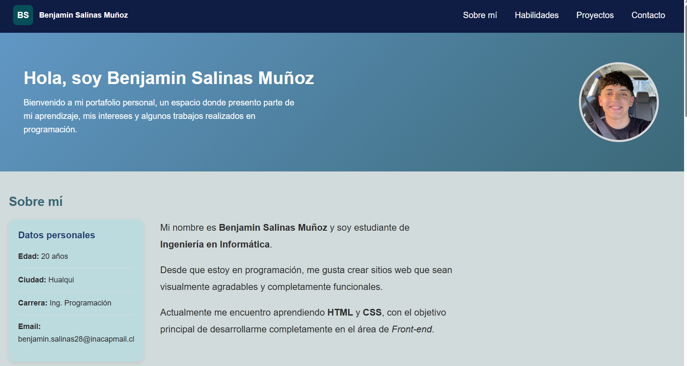

# Portafolio Personal

## Descripción
Proyecto de portafolio web desarrollado en HTML y CSS.

## Contenido
- Presentación personal
- Sección sobre mí
- Habilidades y tabla
- Galería de proyectos
- Formulario de contacto
- Diseño responsive

## Tecnologías utilizadas
- HTML5
- CSS3
- Flexbox
- CSS Grid
- Media Queries

## Autor
Benjamin Salinas Muñoz
Ingeniería en Informática
INACAP

## Vista previa

 